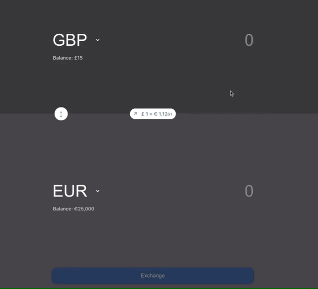
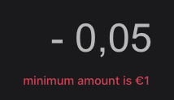
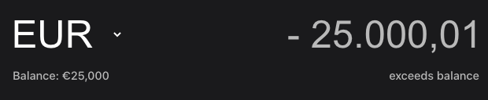
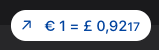
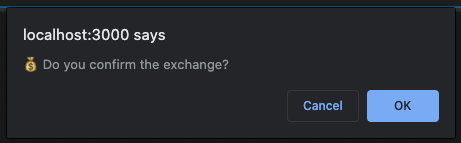
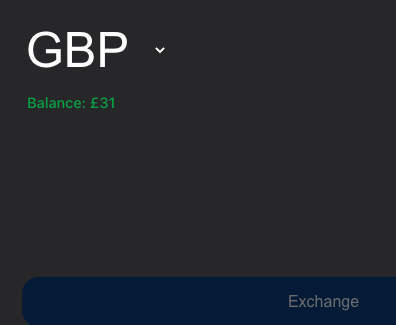
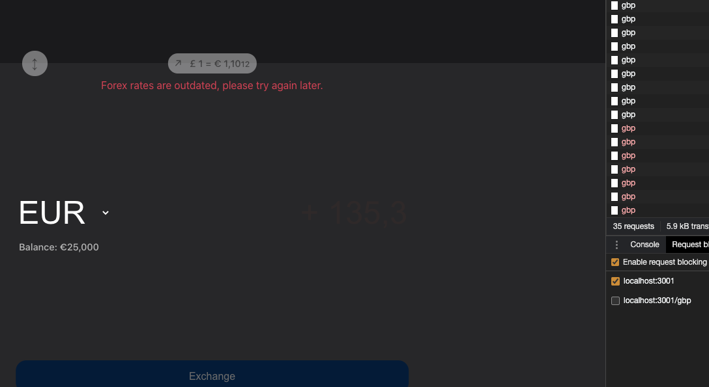
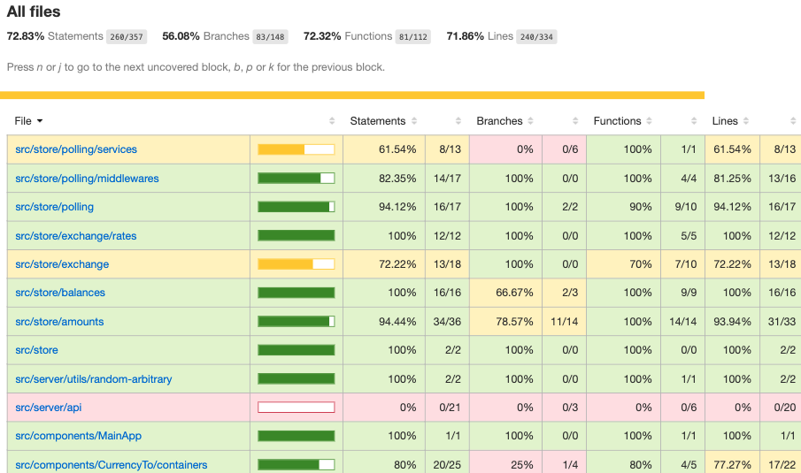

# 💰 [Currency Exchange Mini-App](http://currency-exchange.guicheffer.me/)

This is a mini app playground to display currency exchange in React + Redux + Redux-Saga and TypeScript.

- [The **Demo version** here](http://currency-exchange.guicheffer.me/)
- [The Proxy Api](http://currency-exchange-api.guicheffer.me/)
- [The Real Fake Dummy Weird Api](http://currency-exchange-fake-api.guicheffer.me/BTC) _(keep in mind these rates are from a week before)_

## Summary

- [Demo](http://currency-exchange.guicheffer.me/)
- [Quick preview](#quick-preview)
- [Requirements](#requirements)
- [Available Scripts](#available-scripts)
- [Preview *(screenshots)*](#preview)
- [Tests Coverage](#tests-coverage)
- [Ideas](#ideas)
- [Learn more](#learn-more)

## Quick preview

## Requirements

- _Node_ = `14.*`
- _Yarn_ = `1.*`

## Available Scripts

In the project directory, you might run:

### `make start`

It also correctly bundles React in production mode and optimizes the build for the best performance and extract it to the `build` folder and start the application.

### `make dev`

**ps**. Remember you can also use production's URL directly [here](http://currency-exchange.guicheffer.me/).

Runs the app in the development mode. 🔥 
Make sure you manually open [http://localhost:3000](http://localhost:3000) to view it in the browser.

**Note**: You'll also need to run `make api` in order to get the API running in development.

### `make api`

Run the API and let it up for development tests.

### `make test-stuff`

Launches the test runner in the interactive watch mode.

#### `make test-coverage`

This will generate a coverage folder with more details to be exported afterwards.

### `make i` | `make install`

Install dependencies from yarn's package.json.

### `make help`

Please execute that in order to be aware of what commands you might be able to run.

## Preview

### Warnings messages

#### 📷 &nbsp; Minimum amount

#### 📷 &nbsp; Exceeding balance

___

### Forex rates updates

This happens every 1s even though it could be techinically problematic

___

### Balance related

These following screenshots are related to balance features

#### 📷 &nbsp; Balance update confirmation

#### 📷 &nbsp; Balance update succeed

___

### 📷 &nbsp; Failures

Failures also display UI error handler messages

___

## Tests Coverage

#### 📷 &nbsp; Screenshot of percentage

There's no _codacy_-like for displaying coverage results so I decided to paste here the screenshot directly.

**Note.1**: run `make test-coverage` in order to generate coverage around the tests.  
**Note.2**: this is eventually testing our integration and unit tests around the application.

## Ideas

- [ ] **UX**  
  - I understand there's a big bug around converting from BTC to another currency;
    - This could have been handled in another time but as I didn't want to spend a long time on ther exercise I preferred to keep it simple!
- [ ] **Acessibility**  
  - This application is not very acessible since I did not want to spend a lot of time improving it since I assumed my architecture skills should be taken into account more than reckon with accessibility related stuff.
- [ ] **Architectural**  
  - Many things here could have been improved such as folder structures, api calls, error handling, logs, etc;
  - I think we should review peer dependencies on packages.json - we could use some sort of `Dependabot` in order to make it able to recognize security updates (even GitHub) could do that for us;
  - Design system could be a extracted package on its own since there are many ways of setting colors and variables across the styles (app level);
  - Integration tests
    - There's a lot of space for improving tests and, of course, improving the concept of TDD (which was not applied during the development of this app);
  - Unit tests
    - I ended up not adding tests to the slices since they are part of the "up and running" state of our integration tests "[CurrencySelection.test.tsx](./src/components/CurrencySelection/__tests__/CurrencySelection.test.tsx)" which is eventually our happy path execution;
  - Api-like tests
    - I haven't added many but at least the part where I randomize data for our fake api
- [ ] **Performance**  
  I believe there's a lot of space for performance here
- [ ] **Reusable Code**  
  - I'm not very prod of the usage of styles module across the application, this could have been better refactored in order to reuse cascades and their childs in different parts of components containers.
  - I could add a [Storybook](https://storybook.js.org/) here in order to re-use components for instance the amount input or even the select box for a real world app.

## Learn More

Visit my corner on the web: [guicheffer.me](http://guicheffer.me)
